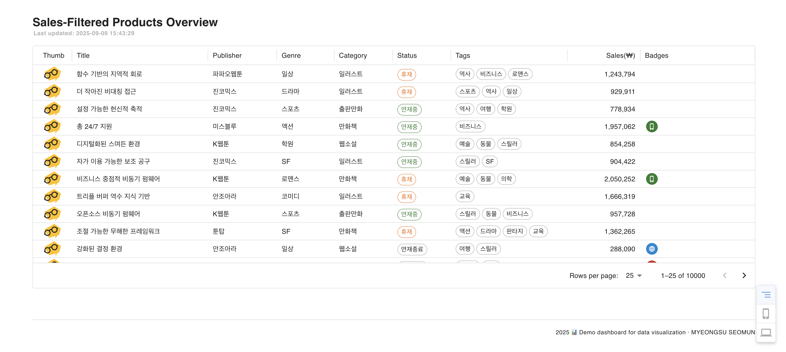
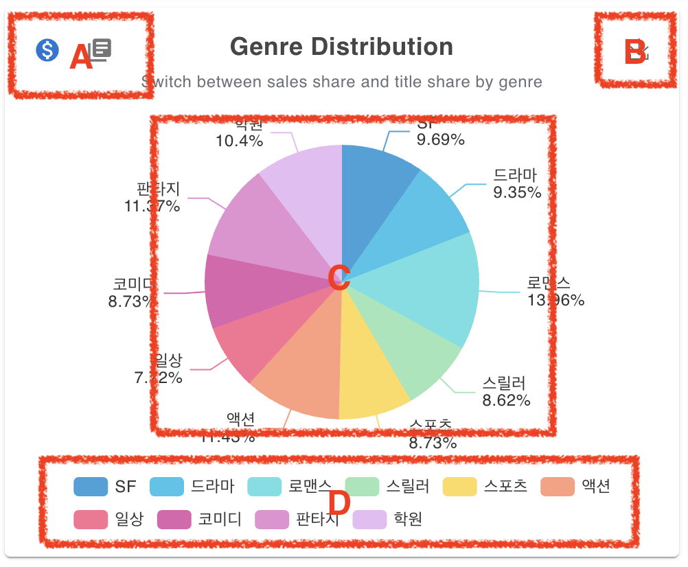
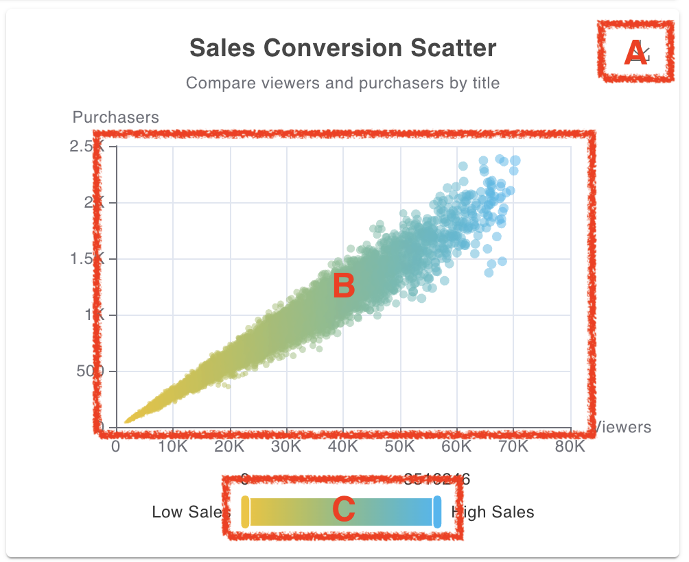
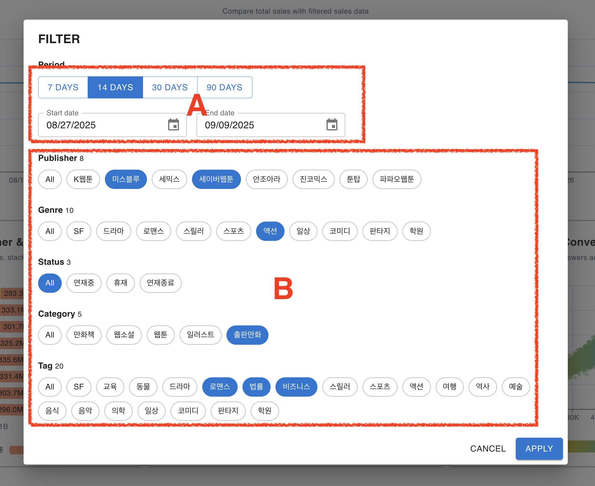
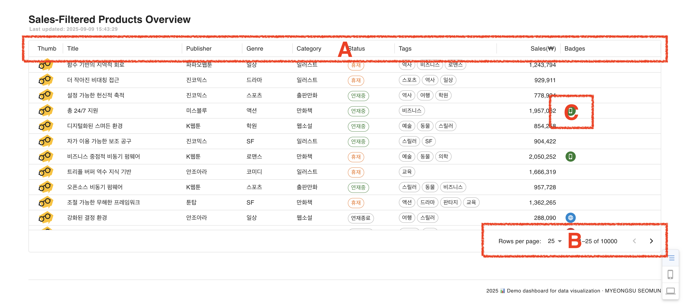

# andrewylies Dashboard

---

## 📖 개요

**andrewylies Dashboard**는 dummy API 매출 데이터를 기반으로  
**필터링, 시각화, 테이블 탐색 기능을 통합한 데이터 분석용 대시보드**입니다.

- **MUI + ECharts 기반의 시각화 및 UI 구성**  
  DataGrid, DatePicker 등 생산성 높은 컴포넌트를 적극 활용하고,  
  ECharts로 라인/스택/파이/산점도 차트를 연동해 다양한 데이터 분석 뷰를 제공합니다.


- **상태 관리 및 동기화 구조**
    - `Zustand`로 필터 모달 상태를 전역 관리
    - `TanStack Router`로 URL 쿼리 파라미터와 동기화  
      → 사용자가 새로고침하거나 URL을 공유해도 동일한 상태가 유지되도록 설계했습니다.


- **실시간성 및 UX 강화**
    - `TanStack Query`로 서버 데이터 캐싱 및 폴링 지원
    - `Framer Motion`을 활용한 애니메이션으로 시각적 피드백 제공
    - `Dayjs`로 날짜 프리셋과 유효성 검증 로직 단순화


## 🚀 실행 방법

---

```bash
# 패키지 설치
npm install

# 개발 서버 실행
npm run dev

# 빌드
npm run build

# 빌드 미리보기
npm run preview
```


## 🛠 사용 기술 및 구현

---
### 핵심 기술 스택

- **[React 19](https://react.dev/) / [TypeScript](https://www.typescriptlang.org/)**  


- **[Vite](https://vitejs.dev/)**  


- **[MUI v7](https://mui.com/)**  
  DataGrid, Date Pickers 같은 고급 컴포넌트와 커스터마이징 가능한 테마 시스템을 사용하여, 반응형 UI와 일관된 디자인을 구현했습니다.


- **[TanStack Router v1](https://tanstack.com/router/latest) & [TanStack Query v5](https://tanstack.com/query/latest)**  
  Router는 SPA 라우팅과 검색 파라미터 상태를 관리하고, Query는 서버 데이터 캐싱과 폴링(polling) 처리로 API 연동을 최적화했습니다.


- **[Zustand](https://zustand-demo.pmnd.rs/)**  
  필터 선택 상태를 전역에서 관리하고, UI 모달과 칩(chip) 상태를 간단히 동기화했습니다.


- **[ECharts](https://echarts.apache.org/) + [echarts-for-react](https://github.com/hustcc/echarts-for-react)**  
  판매 데이터의 라인 차트, 스택 차트, 파이 차트를 구현했으며, 반응형 크기 조절 및 다크모드 테마를 지원했습니다.


- **[Framer Motion](https://www.framer.com/motion/)**  
  필터 모달과 칩 렌더링 시 자연스러운 애니메이션을 적용하여 UX를 강화했습니다.


- **[Dayjs](https://day.js.org/)**  
  날짜 프리셋(예: 최근 7일, 최근 30일) 및 시작/종료일 유효성 검증 로직을 간단히 구현했습니다.


- **[ESLint](https://eslint.org/) + [Prettier](https://prettier.io/)**  
  팀 내 일관된 코드 스타일과 린트 규칙을 유지하여 가독성과 유지보수성을 높였습니다.

## 📂 폴더 구조

---
```
src/
┣ api/                 # API 호출 모듈 (products, sales 등)
┣ assets/              # 정적 리소스 (lottie 애니메이션 등)
┣ components/          # UI 컴포넌트
┃ ┣ charts/            # 차트 관련 컴포넌트 (ChartSection, TableSection 등)
┃ ┣ common/            # 공통 UI 컴포넌트 (Footer, ScrollTop 등)
┃ ┣ filter/            # 필터 UI (FilterModal, FilterSearchBar 등)
┃ ┃ ┗ section/         # 세부 필터 UI (CapsuleSection, DatePickersSection 등)
┃ ┗ icon/              # 아이콘 컴포넌트
┣ constants/           # 상수 정의 (차트, 테이블, 필터 등)
┣ hooks/               # 커스텀 훅 (차트, 필터, API Query 등)
┣ lib/                 # 공용 유틸 함수 (format, search, time 등)
┣ pages/               # 페이지 컴포넌트 (Dashboard, NotFound 등)
┣ stores/              # Zustand 스토어 (filterStore 등)
┣ types/               # 전역 타입 정의
┣ global.css           # 전역 스타일
┣ Layout.tsx           # 전체 레이아웃 컴포넌트
┣ main.tsx             # 엔트리 포인트
┗ router.ts            # 라우터 설정
```

## ✨ 주요 기능

---
#### **Section Overview**
> #### 필터 및 차트 영역 
> 


> #### 필터 모달
> 

> #### 테이블 영역
> 


### 📊 필터 및 차트 영역

> ECharts + echarts-for-react를 활용하여 매출/상품 데이터를 라인, 스택, 파이 차트로 시각화.  
날짜 범위 필터와 실시간 연동되어 동적으로 업데이트됨.


- **A. 필터 버튼**
    - 대시보드 좌측 상단에 위치한 **FILTER** 버튼
    - 클릭 시 필터 모달 열림 → 출판사, 장르, 상태, 태그, 기간 등 조건 선택 가능
    - Zustand로 관리되는 전역 상태와 TanStack Router 쿼리 파라미터로 동기화


- **B. 퀵 액션 메뉴 (플랫폼 전환)**
    - 대시보드 우측 상단에 위치
    - **전체 / 앱 / 웹** 모드로 뷰 전환 가능
    - 선택된 플랫폼 기준으로 모든 차트와 테이블 데이터가 즉시 필터링됨


- **C. 주요 차트 영역**
    - Sales Trends: 전체 매출 추세선 (기간별 매출 변화 확인)
    - Sales by Publisher & Category: 출판사별 매출 및 카테고리 스택 차트
    - Genre Distribution: 장르별 매출 점유율 파이 차트
    - Sales Conversion Scatter: 조회자 수 대비 구매자 수 산점도 → 히트작/로우작 비교 가능

> #### 📊 차트 인터렉션 영역

| Sales Trends                                                                                      | Sales by Publisher & Category                                                                   |
|---------------------------------------------------------------------------------------------------|-------------------------------------------------------------------------------------------------|
|                          |       |
| **A:** 클릭 시 차트를 이미지로 저장 가능. <br/> **B:** 영역 클릭 시 해당 날짜를 즉시 필터링<br/> **C:** 범례를 통해 특정 라인 표시/숨김 제어. | **A:** 클릭 시 차트를 이미지로 저장 가능. <br/> **B:** 영역 클릭 시 해당 카테고리를 즉시 필터링. <br/> **C:** 범례를 통해 특정 카테고리 표시/숨김 제어. |

| Genre Distribution                                                                                                                      | Sales Conversion Scatter                                                                       |
|-----------------------------------------------------------------------------------------------------------------------------------------|------------------------------------------------------------------------------------------------|
|                                                          |           |
| **A:** 보기 모드 전환 (장르별 매출 비율 ↔ 작품 수 비율). <br/> **B:** 클릭 시 차트를 이미지로 저장 가능. <br/> **C:** 영역 클릭 시 해당 장르를 즉시 필터링 <br/> **D:** 범례를 통해 특정 장르 표시/숨김 제어. | **A:** 클릭 시 차트를 이미지로 저장 가능. <br/> **B:** 호버 시 상세 Sales 표시. <br/> **C:** 범례를 통해 특정 Sales 영역 표시/숨김 제어. |


### 🔎 필터 모달

---
> 사용자가 다양한 조건(출판사, 장르, 상태, 태그 등)을 선택하여 데이터를 손쉽게 필터링할 수 있는 모달 제공.  
Zustand로 전역 상태 관리, TanStack Router로 URL 쿼리 동기화.



- **A. 기간 선택 영역**
    - **프리셋 버튼(7일 / 14일 / 30일 / 90일)**과 **직접 날짜 선택(DatePicker)** 지원
    - Dayjs로 날짜 계산 및 포맷 처리
    - 선택된 기간은 TanStack Router의 쿼리 파라미터(`start`, `end`)와 자동 동기화


- **B. 멀티 선택 필터 영역**
    - **Publisher, Genre, Status, Category, Tag** 단위로 필터링 가능
    - `All` 버튼 클릭 시 전체 선택으로 초기화
    - Chip UI를 사용해 선택된 옵션을 시각적으로 표시
    - Zustand를 통해 전역 상태 관리 → 필터 조건은 대시보드 전체 차트 및 테이블과 연동되어 실시간 반영


### 📋 데이터 테이블 (MUI DataGrid)

---
> 상품별 매출, 상태 등을 DataGrid로 표시.  
정렬, 페이지네이션, 칼럼 커스터마이징 기능 지원.



- **A. 컬럼 헤더 영역**
    - **Title, Publisher, Genre, Category, Tags, Sales(₩)** 등 주요 속성을 기준으로 정렬 및 필터링 가능
    - MUI DataGrid의 기본 기능을 활용해 컬럼별 정렬 및 커스터마이징 지원

- **B. 페이지네이션 영역**
    - `Rows per page` 옵션으로 한 페이지에 표시되는 데이터 개수 변경 가능 (예: 25 / 50 / 100)
    - 대규모 데이터셋(최대 10,000 rows)도 효율적으로 탐색 가능

- **C. 상태/아이콘 표시 영역**
    - 각 데이터 행에서 특정 조건(예: 앱 편향, 전환률 낮음)을 아이콘으로 시각화
    - 상태에 따라 색상과 아이콘이 다르게 표시되어 한눈에 데이터 파악이 가능


